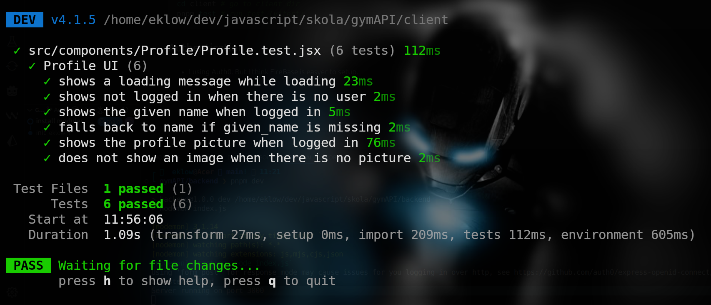
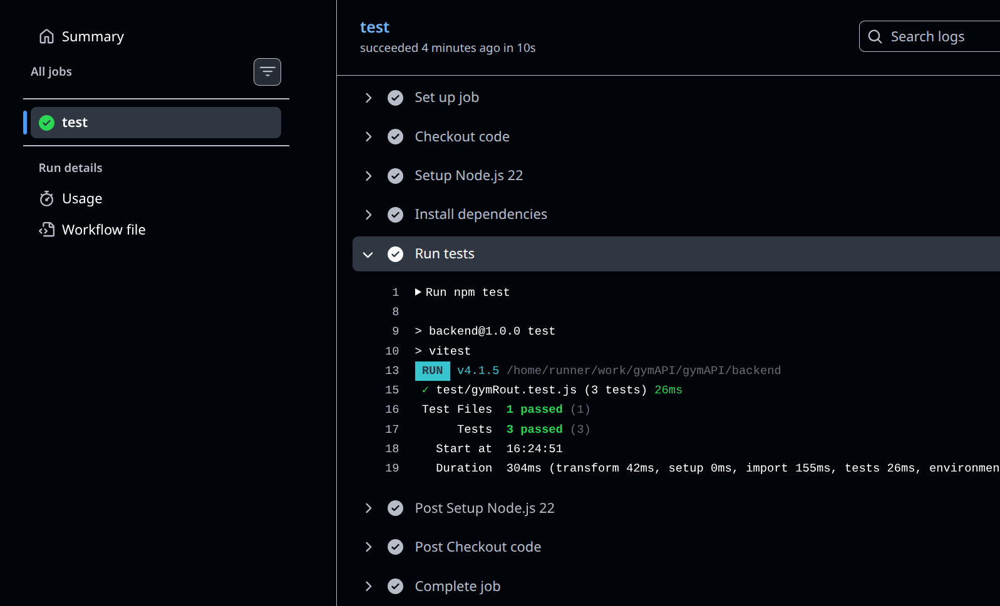

# Gym API modul 3

## clone this repo and run the project

```bash
git clone https://github.com/eklownr/gymAPI.git
cd gymAPI/backend
pnpm i # install modules
pnpm dev # run express backend sever
cd ../client
pnpm i # install modules
pnpm dev # run vite frontend server
```

- VITE ➜ Local: http://localhost:5173/
- Express -> Server running on port 3000

## setup your .env

se .env.example

## Testing

```bash
cd client # go to client dir
pnpm test # run test (vitest)
```



A screenshot of the passing GitHub Actions pipeline



- ...

## Authentication

- I using Auth0. But I think FireBase can be easyer to setup.

* Set up Auth0 Application
* Create an account at Auth0, register your app, and obtain credentials: Domain, Client ID, and Client Secret.
* Configure Settings
* Set allowed URLs in Auth0 Dashboard:
* Allowed Callback URLs: e.g., http://localhost:3000
* Allowed Logout URLs: e.g., http://localhost:3000
* Allowed Web Origins: e.g., http://localhost:3000
